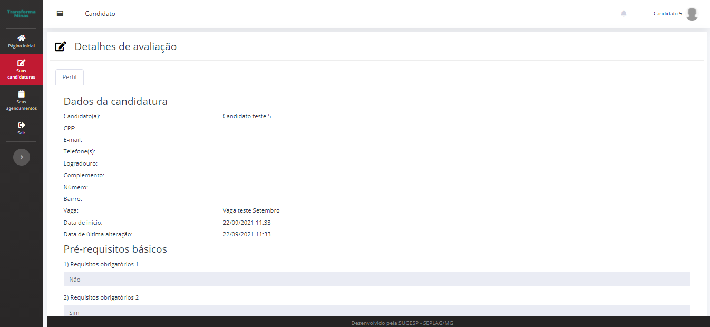

# Visualizar, editar e excluir candidatura

**Retomar preenchimento de formulário de candidatura**


O status "Inscrição pendente" indica que sua candidatura ainda não foi confirmada.


Caso tenha interrompido o preenchimento de um formulário de candidatura e deseje retomar, clique no menu "Suas candidaturas" e identifique a candidatura que deseja retomar.

Clique no botão de fundo amarelo "Continuar preenchimento".

.png>)

Após o clique, o sistema será redirecionado para a tela de preenchimento do formulário de candidatura.

**Exclusão**

Caso note que preencheu alguma informação errada ou deseja desistir da sua candidatura, clique no botão com fundo vermelho "Excluir candidatura".&#x20;

.png>)

Após confirmar a ação, sua candidatura não será mais exibida nessa lista e você poderá candidatar-se novamente na mesma vaga ou escolher outras.

**Detalhes da candidatura**

Caso queira revisar as informações inseridas em todas as etapas do formulário de candidatura, basta clicar no botão com fundo azul "Detalhes". Serão exibidas as informações, respostas e comprovantes da etapa de requisitos obrigatórios e habilitação mínima e o seu currículo cadastrado para a vaga.

